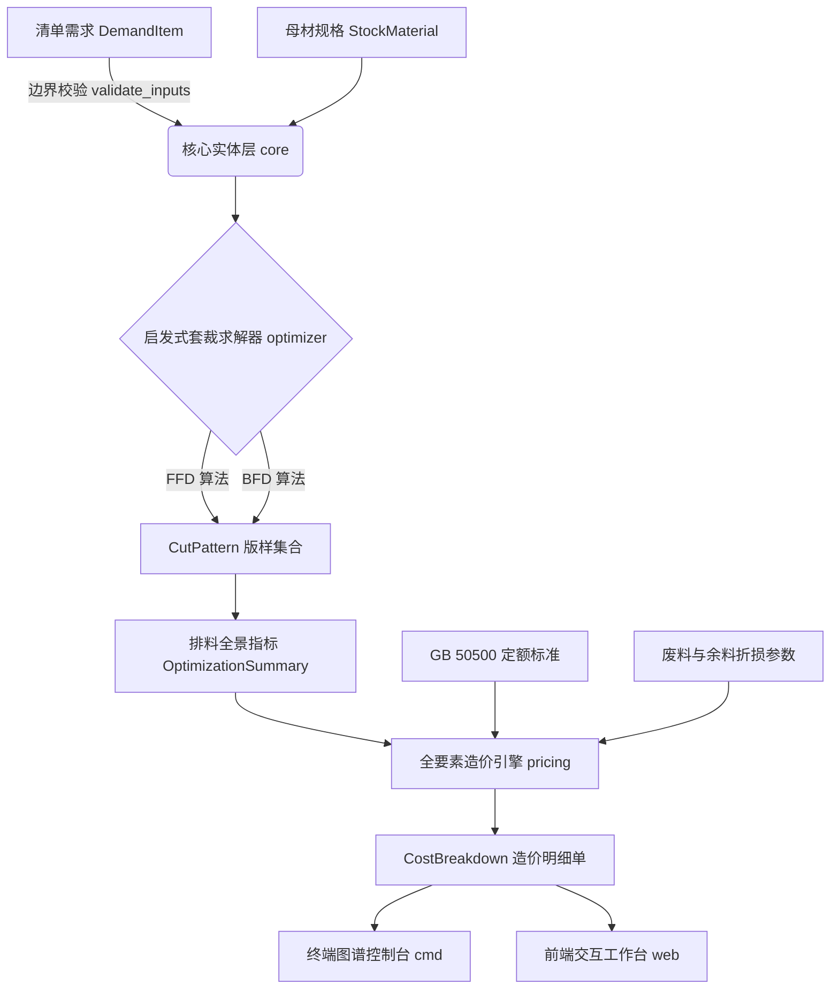

# Scantling

> **高精度建筑型材套裁智能优化与 GB 50500 全要素工程量清单造价规方微内核**  
> *Deterministic Profile Cutting Stock Optimizer & Construction Cost Estimation Engine written in MoonBit.*

[](https://www.moonbitlang.com/)
[](LICENSE)
[](.github/workflows/ci.yml)
[]()
[]()
[]()

---

## 🏗️ 领域痛点与设计背景 (Problem Statement)

在土木与建筑工程造价管理中，钢筋工程（Rebar Works）与钢结构型材（Steel Profiles）约占土建工程直接费的 **30% ~ 40%**。长期以来的行业痛点主要集中在：
* **下料损耗超标**：现行国家定额规范（GB 50500）允许损耗一般为 $2.0\% \sim 3.0\%$，但工地传统粗放的人工估算常造成 $5\%$ 以上的无谓切断损失；
* **余料资产流失**：大量可回用的中短料未建立台账与残值估值模型，被当作废铁折价甚至遗弃；
* **算量与组价脱节**：传统工具难以将排料工艺、锯片切削锯口损失（Kerf Loss）与国家清单计价规范（工料机直接费、企业管理费、利润与建筑业增值税）实现实时端到端联动。

**Scantling**（命名源自经典工料测量学专有名词“规方定尺”，意为规范构件下料尺寸与定额尺度）基于面向 WebAssembly 与云边协同的系统语言 **MoonBit** 构建，将一维下料优化运筹算法（1D Cutting Stock Problem）与国家《建设工程工程量清单计价规范》（GB 50500）深度融合，提供轻量、高确定性、兼备领域边界防护的算尺微内核。

---

## ✨ 核心特性 (Key Features)

1. **双策略启发式套裁竞优 (FFD + Best-Fit Heuristics)**：
   * 针对 NP-Hard 的一维下料问题，采用首次适应降序（FFD）与最佳适应降序（BFD）双启发式竞优求解（理论渐进比上界 $\le \frac{11}{9}\text{OPT} + 1$）。
   * 自动补偿物理切割锯口损失（Kerf Deduction，3.0 ~ 5.0 mm）。
2. **严密的领域边界防御与异常诊断 (Domain Validation)**：
   * 内置 `ValidationError` 强类型校验器，实时防御超长切件、非正定尺长、零需求量及异常锯口等非法工况。
3. **残值回收与可复用余料二元动态核算**：
   * 创新性将截留余料划分为**次级构件复用库（折价冲减）**与**废料残渣（变现回收）**，真实还原现场资金流与材料成本冲减。
4. **GB 50500 现行全要素工料机组价体系**：
   * 严密推导清单综合单价、直接工程费（人工+材料+机械）、企业管理费、利润及建筑业增值税（9%）。
   * 自动与参数化定额基线进行比对，输出成本差额；差额可能为正也可能为负，不能替代项目审计。
5. **全端交互与 WebAssembly 支持**：
   * 提供终端 **CLI ASCII 排料明细可视化**；
   * 提供基于 HTML5/Canvas/SVG 的纯前端 **Web 交互式排料工作台**；
   * 提供可选的 `moon build --target wasm` 构建脚本；当前网页使用独立 JavaScript 参考引擎，尚未在浏览器运行时加载 Wasm。

---

## 🏛️ 系统架构 (Architecture)

Scantling 遵循严格的领域驱动设计（DDD），各包职责清晰解耦：



---

## 🚀 快速开始 (Quick Start)

### 1. 环境准备
确保本机已安装 [MoonBit CLI 工具链](https://www.moonbitlang.com/)：
```bash
moon version
```

### 2. 运行完整自动化测试套件
运行 15 项涵盖领域边界、精准排料、锯口累加、示例复现与免税造价核算的单元测试：
```bash
moon test
```
*测试通过输出：`Total tests: 15, passed: 15, failed: 0.`*

### 3. 代码格式化校验 (CI 规范)
```bash
moon fmt --check
```

### 4. 运行命令行分析控制台
体验地下室框架柱梁典型下料场景的端到端测算与排料图谱输出：
```bash
moon run cmd
```

### 5. WebAssembly 编译
```bash
# Linux / macOS
bash scripts/build_wasm.sh

# Windows PowerShell
.\scripts\build_wasm.ps1
```

### 6. 启动网页交互式工作台
直接在浏览器中双击打开 `web/index.html` 即可使用：
* 支持动态修改母材定尺（9m / 12m）、理论米重、采购单价及锯口损耗；
* 自由添加/删除构件定尺清单；
* 实时查看彩色型材排料图谱、综合单价与定额基线成本差额。

---

## 📊 示例测算 (Illustrative Benchmark)

> **数据性质**：以下是用于演示算法和公式的参数假设，不是第三方审计或独立现场实测结果。实际工程应替换为项目图纸、采购合同和所在地定额数据。

* **原材规格**：HRB400E Φ25（9,000 mm 定尺，3.85 kg/m，3,850 元/吨）
* **工艺损耗参数**：锯口 3.0 mm，余料复用阈值 800.0 mm

| 评价维度 | 当前模型输出 | 说明 |
| :--- | :--- | :--- |
| **母材耗用量** | **12 根** | 当前示例输入下的 FFD/BFD 竞优结果 |
| **综合材料损耗率** | **0.875%** | 锯口损耗与不可复用残料占母材总长比例 |
| **余料二次复用率** | **10.421%** | 达到复用阈值的余料占母材总长比例 |
| **清单材料净成本** | **¥ 1,450.66** | 当前参数化价格与回收模型输出 |
| **清单综合单价** | **¥ 5,658.06 /t** | 当前参数化模型输出 |
| **与定额基线成本差额** | **-¥ 33.19** | 负值表示当前模型下未形成成本节约 |

该示例的 CLI 输出以当前源码为准。由于人工费和机具费按采购毛重计提，较低废料率不必然自动转化为较低总造价；实际项目需要使用当地定额、合同价格和工艺数据重新校准。

---

## 📂 项目模块结构 (Repository Layout)

```
scantling/
├── .github/workflows/      # GitHub Actions CI 自动化流水线
│   └── ci.yml              # 持续集成检测 (Format + Typecheck + Test)
├── core/                   # 领域实体模型与强类型参数校验器
│   ├── types.mbt           # Stock, Demand, Pattern, ValidationError
│   ├── types_test.mbt      # 实体构建与异常边界防御测试
│   └── moon.pkg
├── optimizer/              # 一维切削套裁组合优化算法
│   ├── cutting_stock.mbt   # FFD & Best-Fit 启发式近似求解引擎
│   ├── cutting_stock_test.mbt # 零余料、高锯口、空输入与竞优测试
│   └── moon.pkg
├── pricing/                # GB 50500 工程造价定额与工料机全要素测算引擎
│   ├── quota.mbt           # 综合单价、费率分摊与余料折损冲减
│   ├── quota_test.mbt      # 财务守恒、免税工况与边界测试
│   └── moon.pkg
├── cmd/                    # 终端交互入口与 ASCII 排料图谱可视化看板
├── web/                    # 纯前端交互工作台 (支持离线与本地浏览器直接运行)
├── docs/                   # 专业工程文档
│   ├── specifications.md   # 1D-CSP 数学模型与造价计算标准公式推导
│   └── retrospective.md    # 架构选型权衡与技术演进回顾
├── scripts/                # 自动化构建脚本 (Wasm 构建)
│   ├── build_wasm.sh
│   ├── build_wasm.ps1
│   ├── ci.sh
│   └── ci.ps1
├── moon.mod                # MoonBit 模块配置定义
├── .gitignore              # 工程构建产物过滤
├── LICENSE                 # Apache-2.0 开源许可协议
└── README.md               # 项目主文档
```

## 🔍 开发透明度 (Development Transparency)

项目采用人工主导、AI 辅助的开发方式。AI 可用于 API 查询、重复性代码草拟、边界用例枚举和编译诊断，但领域决策、公开声明和验收结果由项目维护者审核确认。详见 [AI_ASSISTED.md](AI_ASSISTED.md) 与 [docs/development-log.md](docs/development-log.md)。

---

## 📄 开源许可证

本项目采用 [Apache-2.0 License](LICENSE) 开源许可。
