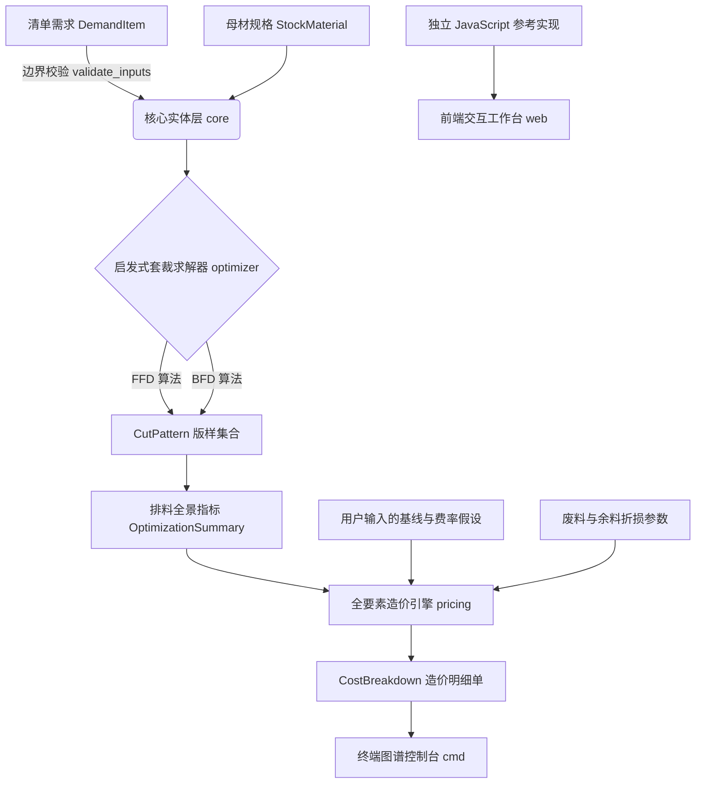

# Scantling

> **一维型材套裁启发式与参数化造价演示**
> *MoonBit FFD/BFD cutting-stock heuristics and a configurable cost formula model.*

[](https://www.moonbitlang.com/)
[](LICENSE)
[CI workflow](.github/workflows/ci.yml) · [AI 辅助范围](AI_ASSISTED.md)

---

## 🏗️ 领域痛点与设计背景 (Problem Statement)

本仓库用示例输入展示定尺切件、锯口和余料分类如何影响一维排料结果及参数化成本。仓库没有现场损耗样本、当地定额数据库或独立性能基准，因此不对工程损耗率、造价合规性和运行速度作实测承诺。

MoonBit 包实现 FFD/BFD 启发式和可配置公式；浏览器工作台运行独立 JavaScript 参考实现。两套实现目前没有统一运行时或跨语言等价性验证。

---

## ✨ 核心特性 (Key Features)

1. **双策略启发式套裁竞优 (FFD + Best-Fit Heuristics)**：
   * 使用首次适应降序（FFD）与最佳适应降序（BFD），按母材根数、再按残料长度择优；不证明全局最优。
   * 按用户输入的锯口宽度计入切件之间的长度损耗；每根母材的第一个切件前不计锯口。
2. **输入边界校验 (Domain Validation)**：
   * `ValidationError` 报告超长切件、非正定尺长、非正需求量、负锯口及长度/锯口/余料阈值中的非有限浮点输入；不保证任意规模下的浮点汇总精度。
3. **余料与残料分类估值**：
   * 按阈值区分可复用余料和残料，再依输入价格、折价率计算模型中的成本冲减；没有库存或回收交易数据。
4. **参数化造价公式**：
   * 根据输入的材料、人工、机械价格及管理费、利润、税率计算成本与综合单价；默认参数是演示假设，不代表当地定额或 GB 50500 合规审查。
   * 与同一参数集构造的基线比较成本差额；结果不能替代项目审计。
5. **CLI、网页与可选 WebAssembly 构建**：
   * 提供终端 **CLI ASCII 排料明细可视化**；
   * 提供基于 HTML5/Canvas/SVG 的纯前端 **Web 交互式排料工作台**；
   * 提供可选的 `moon build --target wasm` 构建脚本；当前网页使用独立 JavaScript 参考引擎，尚未在浏览器运行时加载 Wasm。

---

## 🏛️ 系统架构 (Architecture)

Scantling 将数据结构、启发式排料、参数化计价和终端入口分包组织：



---

## 🚀 快速开始 (Quick Start)

### 1. 环境准备
确保本机已安装 [MoonBit CLI 工具链](https://www.moonbitlang.com/)：
```bash
moon version
```

### 2. 运行完整自动化测试套件
运行领域边界、排料、锯口、示例输出回归与造价公式单元测试：
```bash
moon test
```
以本机命令的实际测试计数和结果为准；示例输出回归测试仅确认当前实现可复现。

### 3. 代码格式化校验 (CI 规范)
```bash
moon fmt --check
```

### 4. 运行命令行分析控制台
查看假设的框架柱梁切件输入及模型输出：
```bash
moon run cmd
```

### 5. 运行最小公共 API Demo
用一个小规模、可复现的输入，快速查看“校验 → 优化 → 造价”完整链路：
```bash
moon run examples/quickstart
```
该 Demo 输出母材根数、余料/废料、损耗率和参数化成本结果；它是演示程序，不宣称全局最优或替代工程审计。

### 6. WebAssembly 编译
```bash
# Linux / macOS
bash scripts/build_wasm.sh

# Windows PowerShell
.\scripts\build_wasm.ps1
```

### 7. 启动网页交互式工作台
直接在浏览器中双击打开 `web/index.html` 即可使用：
* 支持动态修改母材定尺（9m / 12m）、理论米重、采购单价及锯口损耗；
* 自由添加/删除构件定尺清单；
* 查看彩色型材排料图谱、参数化综合单价与假设基线成本差额。网页结果来自独立 JavaScript 引擎，未验证与 MoonBit 逐项等价。

---

## 📊 示例测算 (Illustrative Benchmark)

> **数据性质**：以下是当前 CLI 输出的回归示例。回归测试确认数值随当前源码可复现，并不独立证明排料最优、业务公式正确、第三方审计或现场实测。实际工程须按图纸、合同、当地规则和工艺数据重新核验。

* **原材规格**：HRB400E Φ25（9,000 mm 定尺，3.85 kg/m，3,850 元/吨）
* **工艺损耗参数**：锯口 3.0 mm，余料复用阈值 800.0 mm

| 评价维度 | 当前模型输出 | 说明 |
| :--- | :--- | :--- |
| **母材耗用量** | **12 根** | 当前示例输入下的 FFD/BFD 竞优结果 |
| **综合材料损耗率** | **0.875%** | 锯口损耗与不可复用残料占母材总长比例 |
| **余料二次复用率** | **10.421%** | 达到复用阈值的余料占母材总长比例 |
| **清单材料净成本** | **¥ 1,450.66** | 当前参数化价格与回收模型输出 |
| **清单综合单价** | **¥ 5,658.06 /t** | 当前参数化模型输出 |
| **与假设基线成本差额** | **-¥ 33.19** | 负值表示当前模型下未形成成本节约 |

该示例的 CLI 输出以当前源码为准。由于人工费和机具费按采购毛重计提，较低废料率不必然自动转化为较低总造价；实际项目需要使用当地定额、合同价格和工艺数据重新校准。

---

## 📂 项目模块结构 (Repository Layout)

```
scantling/
├── .github/workflows/      # GitHub Actions CI 自动化流水线
│   └── ci.yml              # 持续集成检测 (Format + Typecheck + Test)
├── .github/PULL_REQUEST_TEMPLATE.md # 人工审查与发布门禁清单
├── core/                   # 领域实体模型与强类型参数校验器
│   ├── types.mbt           # Stock, Demand, Pattern, ValidationError
│   ├── types_test.mbt      # 实体构建与异常边界防御测试
│   └── moon.pkg
├── optimizer/              # 一维切削套裁组合优化算法
│   ├── cutting_stock.mbt   # FFD & Best-Fit 启发式近似求解引擎
│   ├── cutting_stock_test.mbt # 零余料、高锯口、空输入与竞优测试
│   └── moon.pkg
├── pricing/                # 参数化成本公式与假设基线
│   ├── quota.mbt           # 综合单价、费率分摊与余料折损冲减
│   ├── quota_test.mbt      # 财务守恒、免税工况与边界测试
│   └── moon.pkg
├── cmd/                    # 终端交互入口与 ASCII 排料图谱可视化看板
├── examples/quickstart/    # 面向评审与新用户的最小公共 API Demo
├── web/                    # 纯前端交互工作台 (支持离线与本地浏览器直接运行)
├── docs/                   # 专业工程文档
│   ├── specifications.md   # 1D-CSP 数学模型与造价计算标准公式推导
│   ├── retrospective.md    # 架构选型权衡与技术演进回顾
│   ├── human-review-record.md # 当前提交的人工审查记录
│   └── project-application.md # 项目申报书
├── scripts/                # 自动化构建脚本 (Wasm 构建)
│   ├── build_wasm.sh
│   ├── build_wasm.ps1
│   ├── ci.sh
│   └── ci.ps1
├── moon.mod                # MoonBit 模块配置定义
├── .gitignore              # 工程构建产物过滤
├── LICENSE                 # Apache-2.0 开源许可协议
└── README.md               # 项目主文档
```

## 🔍 开发透明度 (Development Transparency)

项目采用人工主导、AI 辅助的开发方式。仓库保留真实的 AI 辅助提交归属，不通过改写历史制造人工作者。发布或提交前，项目维护者需要按 [docs/human-review-record.md](docs/human-review-record.md) 逐项检查并确认当前提交；[AI_ASSISTED.md](AI_ASSISTED.md) 与 [docs/development-log.md](docs/development-log.md) 记录辅助边界和实际验证过程。

---

## 📄 开源许可证

本项目采用 [Apache-2.0 License](LICENSE) 开源许可。
