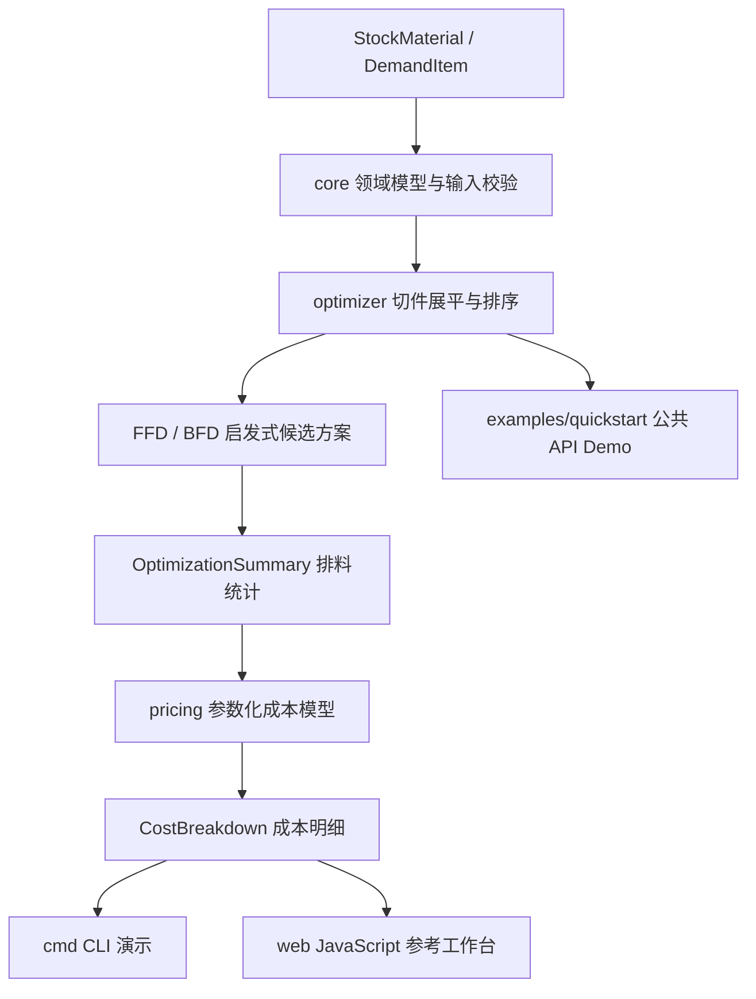

# Scantling 项目申报书

> 本申报书根据仓库当前公开代码、文档和验证记录编写。文中将“实现能力”“演示结果”和“后续计划”明确区分，不把参数化模型表述为工程审计、地方定额数据库或合规认证。

## 一、基本信息

- **项目名称**：Scantling：一维型材套裁启发式与参数化造价模型
- **英文名称**：Scantling: MoonBit Cutting-Stock Heuristics & Parameterized Cost Model
- **参赛者 / 团队**：韦昌豪（GitHub: Wchwch777）
- **联系方式**：手机：18260898003 ｜ 邮箱：1341376491@qq.com
- **GitHub 仓库链接**：<https://github.com/Wchwch777/Scantling>
- **项目方向**：MoonBit 工程优化、型材下料算法与可解释成本模型
- **实现语言**：MoonBit；浏览器演示使用独立 JavaScript 参考实现
- **是否为移植项目**：否。本项目不是对某个既有同类工程的直接移植，核心数据模型、套裁启发式和参数化计价逻辑按 MoonBit 包结构原生组织。
- **开源许可证**：Apache-2.0
- **当前提交基线**：代码评审基线 `a7ba35b`；后续公开提交主要补充审查和文档记录。

## 二、项目简介

Scantling 是一个使用 MoonBit 编写的一维型材套裁与参数化造价演示引擎。项目针对建筑工程中“定尺母材、构件切件、锯口损耗、余料分类和材料成本”经常分散处理的问题，建立从输入校验、切件排料、损耗统计到成本估算的可复现计算链路。

项目的核心问题是：给定一组母材规格和构件切件需求，如何在考虑锯口宽度的情况下，将切件放入尽可能少的母材中，并对每根母材的剩余长度进行可复用余料或废料分类。Scantling 使用 FFD（First-Fit Decreasing）和 BFD（Best-Fit Decreasing）两种确定性启发式生成候选方案，再按母材根数和不可复用残料长度进行选择。

在排料结果之上，项目提供一个参数化成本模型，将材料采购投入、废料回收估值、可复用余料折价、人工费、机具费、管理费、利润和税率纳入同一份成本明细。所有价格、费率和余料折价均为输入参数或演示默认值，项目不声称拥有地方定额数据库，也不把模型结果表述为 GB 50500 合规审查、现场实测或工程审计结论。

项目同时提供 MoonBit CLI、最小公共 API Demo、可选 WebAssembly 构建脚本和浏览器交互式参考工作台，使评审者可以从命令行、自动化测试和网页三个层面观察项目行为。

## 三、项目背景与问题定义

在钢筋、型钢和其他定尺材料的加工场景中，材料利用率不仅取决于切件总长度，还受到以下因素影响：

1. 不同切件长度组合会产生不同的装载方案；
2. 每根母材的第二个及后续切件会产生锯口损耗；
3. 剩余长度达到一定阈值时，可能具备后续复用价值；
4. 废料回收和可复用余料折价会影响材料净成本，但两者并不等同于现金收入；
5. 采购毛重、设计净用量和综合单价需要明确区分；
6. 工程造价费率与税务处理依赖项目地区、合同和定额口径，不能由一个固定数字替代。

Scantling 将上述因素拆分为可测试的领域对象和参数，目标不是宣称替代现有工程软件，而是提供一个小型、透明、可复现、便于扩展的 MoonBit 领域计算内核。

## 四、核心功能范围

### 4.1 领域数据模型

- `StockMaterial`：母材编号、名称、定尺长度、理论米重和采购单价；
- `DemandItem`：构件编号、切件长度、需求数量和说明标签；
- `CutPiece`：展平后的单个切件；
- `CutPattern`：单根母材的切件组合、锯口损耗、剩余长度和余料分类；
- `OptimizationSummary`：母材根数、需求总长、锯口总长、可复用余料、废料和比例指标；
- `ValidationError`：对非法长度、数量、锯口和非有限浮点输入提供结构化错误类型。

### 4.2 一维套裁启发式

- 将需求数量展平为独立切件；
- 按切件长度降序排列；
- 执行 FFD 和 BFD 两种确定性启发式；
- 每根母材的第一个切件不计锯口，后续切件按配置计入锯口宽度；
- 按母材根数优先、不可复用残料长度其次的规则选择候选方案；
- 保留 `try_*` 返回错误的安全入口，同时保留对合法输入直接返回结果的兼容入口；
- 明确说明启发式不等于全局最优解。

### 4.3 余料与损耗统计

- 按 `min_reusable_length_mm` 将剩余长度划分为可复用余料或废料；
- 统计锯口损耗、废料长度、可复用余料长度；
- 计算综合材料损耗率和余料复用率；
- 保持切件长度、锯口、余料和母材总长之间的守恒关系。

### 4.4 参数化成本模型

- 按理论米重将长度折算为吨位；
- 计算原材采购总投入；
- 按废料回收单价估算废料回收冲减；
- 按余料折价比例估算余料结存冲减；
- 根据输入的人工费、机具费、管理费率、利润率和税率计算参数化总成本；
- 计算以设计净用量为分母的综合单价；
- 与同一参数集构造的假设基线进行差额比较；
- 明确标注模型结果不等于当地定额核验或工程审计。

### 4.5 交互入口与演示

- `moon run cmd`：运行完整 CLI 示例，输出输入清单、排料版样和成本明细；
- `moon run examples/quickstart`：运行最小公共 API Demo，展示“校验 → 优化 → 造价”链路；
- `web/index.html`：离线打开的浏览器工作台，使用独立 JavaScript 参考实现展示排料图谱和参数化成本；
- `scripts/build_wasm.*`：构建 MoonBit WebAssembly 产物；当前页面尚未在浏览器运行时加载该 Wasm 产物。

## 五、系统架构与技术路线



### 5.1 包职责

| 包或目录 | 职责 | 当前边界 |
| --- | --- | --- |
| `core` | 定义母材、需求、切件、版样、汇总和验证错误 | 不包含排料策略和成本规则 |
| `optimizer` | 实现 FFD、BFD、锯口处理和候选方案选择 | 不证明全局最优，不依赖造价包 |
| `pricing` | 实现参数化成本、余料折价和假设基线 | 不提供地方定额库、库存系统或审计结论 |
| `cmd` | 提供完整命令行示例和可读输出 | 使用固定的演示输入 |
| `examples/quickstart` | 提供简洁公共 API 使用示例 | 用于上手和评审，不代表工程数据 |
| `web` | 提供离线浏览器参考工作台 | 与 MoonBit 核心实现尚未做逐项等价性测试 |
| `scripts` | 提供 CI 和 Wasm 构建入口 | 构建 Wasm，不负责浏览器加载集成 |

### 5.2 计算口径

对一根母材，若包含 `k` 个切件，则物理长度约束为：

```text
sum(cut_length) + max(0, k - 1) * kerf_width <= stock_length
```

剩余长度为：

```text
remnant = stock_length - sum(cut_length) - kerf_loss
```

当剩余长度达到配置阈值时计入可复用余料，否则计入废料。成本模型则使用用户输入的米重、价格、人工费、机具费和费率进行折算。所有小数计算使用 `Double`，仓库不宣称任意规模输入下均满足财务级精度。

## 六、项目特色与可复用价值

### 6.1 对 MoonBit 生态的价值

- 使用 MoonBit 原生包结构组织一个包含领域模型、启发式算法和成本模型的完整小型工程；
- 展示同一核心库如何被 CLI、Demo 和 Wasm 构建流程消费；
- 提供结构化输入错误、兼容入口、测试和 CI，便于其他 MoonBit 项目参考；
- 在不引入第三方求解器的情况下，提供清晰的 1D cutting-stock 入门实现。

### 6.2 对工程计算场景的价值

- 将母材长度、切件长度和锯口损耗放入统一计算链路；
- 将可复用余料与废料分开统计，避免把两者直接混成一个损耗值；
- 将“计算结果”和“业务口径”分离，让价格和费率可以由项目方替换；
- 用回归测试固定演示结果，方便评审者复跑并发现变化。

### 6.3 可解释性

每根母材都可以输出切件列表、锯口损耗、剩余长度和分类状态。项目不只输出一个“优化率”，而是保留可以人工复核的版样明细和成本分项。

## 七、预期验收产物

### 7.1 代码与库接口

- 可构建的 MoonBit 模块 `scantling`；
- `core`、`optimizer`、`pricing` 三个可独立理解的职责包；
- 带结构化错误的 `try_solve_*` 和 `try_optimize_cutting_stock` 入口；
- FFD/BFD 结果、版样和成本明细的公开数据结构。

### 7.2 可运行演示

- CLI 完整工程示例；
- `examples/quickstart` 最小公共 API Demo；
- 可离线打开的网页交互参考工作台；
- 可选的 MoonBit Wasm 构建产物。

### 7.3 测试与验证

当前代码基线已经完成以下验证：

```text
moon fmt --check                    PASS
moon check                          PASS
moon test                           24 passed, 0 failed
moon run cmd                        PASS
moon run examples/quickstart       PASS
.\scripts\ci.ps1                   PASS
.\scripts\build_wasm.ps1           PASS
```

GitHub Actions 对仓库执行格式检查、类型检查、测试、CLI 和 Wasm 构建。测试覆盖领域边界、锯口精确匹配、空需求、超长切件、非有限输入、启发式边界、切件守恒、成本公式和演示基准回归。

### 7.4 文档与过程记录

- README 快速开始和项目结构说明；
- 一维套裁数学模型与参数化成本公式说明；
- 架构回顾与限制说明；
- AI 辅助边界说明；
- 开发与验证日志；
- 项目所有者人工审查记录。

## 八、示例结果与可复现基准

仓库 CLI 使用一组固定的演示输入：9,000 mm 母材、3.0 mm 锯口、800 mm 余料阈值，以及四类构件需求。当前模型输出包括：

| 指标 | 当前演示输出 | 解释 |
| --- | ---: | --- |
| 母材耗用量 | 12 根 | 当前 FFD/BFD 候选选择结果 |
| 设计净长度 | 95,800 mm | 所有需求切件长度之和 |
| 锯口损耗 | 72 mm | 每根母材的后续切件计锯口 |
| 可复用余料 | 11,255 mm | 达到阈值的剩余长度 |
| 废料残余 | 873 mm | 未达到阈值的剩余长度 |
| 综合材料损耗率 | 0.875% | 锯口与废料除以母材总长 |
| 余料复用率 | 10.421% | 可复用余料除以母材总长 |
| 材料净成本 | 约 ¥1,450.66 | 当前参数化价格与折价假设 |
| 综合单价 | 约 ¥5,658.06/t | 当前参数化费率与净用量 |
| 假设基线差额 | 约 -¥33.19 | 不是工程审计或实际节约承诺 |

这些数值由回归测试锁定其当前可复现性，但不证明启发式方案是全局最优，不证明成本公式符合某一地区的定额，也不构成现场工程测量结果。

## 九、项目进度与后续计划

### 已完成

1. 建立 MoonBit 模块和 `core / optimizer / pricing` 包结构；
2. 实现 FFD/BFD 一维套裁启发式和锯口损耗处理；
3. 实现余料分类和参数化成本模型；
4. 建立 CLI、quickstart Demo、Web 参考工作台和 Wasm 构建入口；
5. 增加边界、守恒、成本公式和演示结果回归测试；
6. 建立 GitHub Actions 自动验证流程；
7. 补充 AI 辅助边界和仓库所有者人工审查记录。

### 后续计划

1. 为 Web 参考实现补充更严格的输入校验和浏览器自动化测试；
2. 增加 MoonBit 与 JavaScript 参考实现之间的跨实现一致性测试；
3. 对材料价格、人工费、机具费和费率增加更完整的数值边界校验；
4. 在工具链发布机制稳定后，为 CI 固定可验证的 MoonBit 版本；
5. 使用公开、可引用的数据集或精确求解器，对启发式结果进行更大规模的对照实验；
6. 若进入工程应用阶段，再单独引入当地定额、合同、库存和回收交易数据。

## 十、限制、风险与应对

| 风险 | 当前表现 | 应对方式 |
| --- | --- | --- |
| 启发式不是全局最优 | FFD/BFD 可能在特定实例中使用更多母材 | 明确披露边界，后续增加精确对照或更多策略 |
| 造价参数不是地方定额 | 默认费率和价格为演示假设 | 由使用方传入项目参数，不宣称合规认证 |
| Web 与 MoonBit 尚未统一运行时 | 网页使用独立 JavaScript | 保持文档透明，后续增加 parity 测试或 Wasm 集成 |
| 浮点精度有限 | 使用 `Double`，不保证任意规模财务精度 | 做输入边界校验，后续评估定点或更严格数值策略 |
| CI 工具链变化 | 安装脚本当前使用可用的稳定通道 | 持续记录实际版本并寻找可验证的固定分发方式 |
| 工程数据不足 | 当前没有现场损耗、库存和当地定额样本 | 将结果定位为演示和研究性模型，不替代工程审计 |

## 十一、AI 辅助与人工主导说明

本项目采用人工主导、AI 辅助的方式推进。AI 可以参与 API 查询、重复性代码草拟、边界用例枚举、文档整理和编译诊断；项目范围、算法选择、模型口径、公开声明和最终提交由仓库维护者决定。

仓库保留真实的 AI 辅助提交归属，不通过改写历史制造人工作者。当前代码评审基线为 `a7ba35b`，项目维护者已在 `docs/human-review-record.md` 中记录审查范围、限制、验证结果和接受决定。该记录的意义是说明具体检查了什么，而不是声称 AI 没有参与。

## 十二、移植与参考说明

本项目不是对其他软件项目的直接移植，不使用某个外部项目作为必须保持行为一致的参考实现。项目主要参考以下公开问题类型和工程概念：

- 一维 Cutting Stock Problem 的经典启发式方法；
- 建筑材料定尺下料中的锯口、余料和废料分类概念；
- 参数化成本核算中材料、人工、机具、管理费、利润和税率的分项关系；
- MoonBit 模块、测试、CLI 和 WebAssembly 工程实践。

代码中的具体数据结构、包边界、错误类型和示例输入属于本项目自身实现。仓库不声称实现某个第三方商业软件的全部功能，也不声称与外部排料软件逐项一致。

## 十三、开源与许可

项目采用 Apache-2.0 License。参赛评审可以直接查看源码、文档、测试、CI 配置和提交历史。任何实际工程使用都应根据图纸、采购合同、当地计价规则、税务处理和现场工艺重新校验参数与结论。

## 十四、申报承诺

本项目申报材料中的演示数据、成本结果和性能边界均以仓库当前源码和验证记录为准。项目团队不把启发式结果包装成全局最优，不把参数化成本模型包装成工程审计或地方定额合规结论，也不把自动化验证包装成人工领域审核。项目将继续保持代码、文档、测试结果和 AI 辅助边界之间的一致性。
